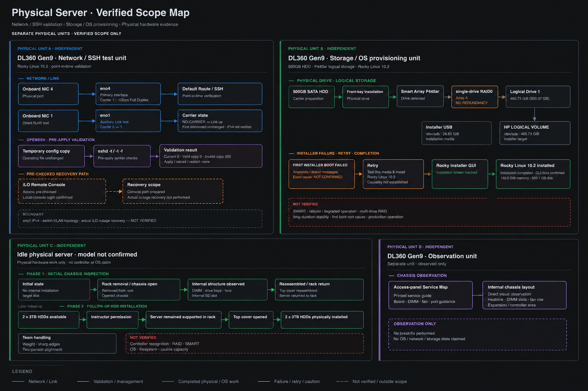
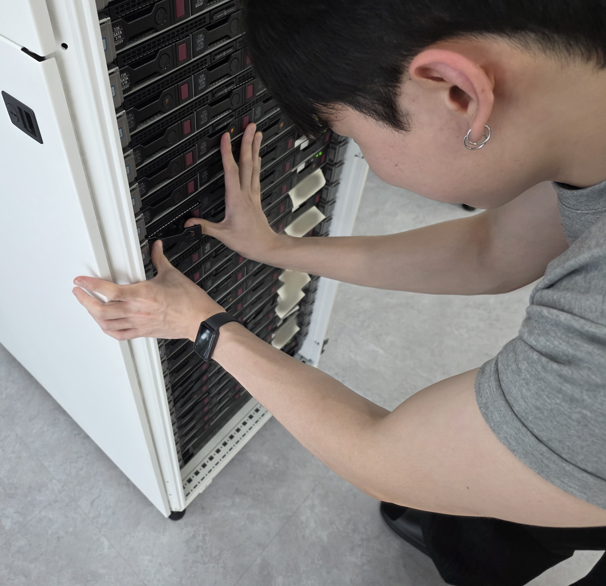
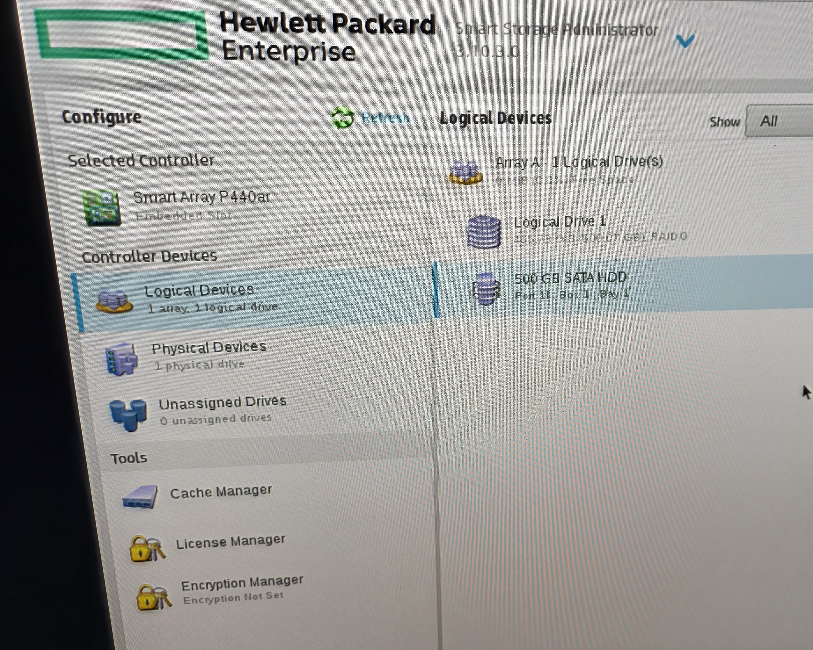

# 물리 서버 Link/OpenSSH 검증과 스토리지·Rocky Linux 프로비저닝

**서로 다른 HPE 실습 장비에서 NIC·Link/OpenSSH, 물리 HDD 장착, Smart Array와 Rocky Linux 설치 흐름을 역할별로 확인한 기록**

## 1. 한 문장 요약

Azure VM에서 보이지 않던 물리 계층이 궁금해 별도 HPE 실습 장비에서
NIC·Link/Carrier와 OpenSSH를 검증하고, 모델 미확정 유휴 서버에는 3TB HDD 2개를 물리 장착했으며,
또 다른 DL360 Gen9에서는 500GB HDD의 P440ar single-drive RAID0 구성과 Rocky Linux 10.2 설치를 확인했다.



## 핵심 결과

- 물리 NIC 4 ↔ `eno4`, NIC 1 ↔ `eno1`을 매핑하고 Carrier `0 → 1 → 1(첫 분리에서 변화 없음) → 0 → 1 → 0` 흐름을 확인했다.
- OpenSSH 현재 설정과 정상 복사본은 종료 코드 `0`, 오류 복사본은 `255`였으며 운영 파일 변경과 reload·restart는 없었다.
- 모델 미확정 유휴 서버에 3TB HDD 2개를 물리 장착했다. Controller 인식·RAID·SMART·OS·filesystem·실제 사용 가능 용량은 확인하지 않았다.
- 별도 DL360 Gen9에서 500GB SATA HDD를 장착하고 P440ar single-drive RAID0, Logical Drive 1과 465.73 GiB를 구성했다.
- Rocky installer에서 HP Logical Volume `/dev/sda`를 확인하고 Rocky Linux 10.2 설치와 GUI boot를 확인했다. 첫 installer boot 실패의 정확한 원인은 확정하지 않았다.

## 2. 시작 이유

개인 프로젝트 1에서는 Azure Load Balancer와 Rocky Linux VM의
네트워크·방화벽·서비스 계층을 확인했다.
클라우드에서는 실제 NIC·케이블·저장장치·냉각 구조가 추상화돼 있어
다음과 같은 물리 서버의 구성이 궁금해졌다.

- 실제 서버에는 NIC가 왜 여러 개 있는가?
- 물리 NIC는 `eno1`, `eno4` 같은 Linux 인터페이스와 어떻게 대응되는가?
- 케이블 연결·분리 상태는 Linux에서 어떻게 보이는가?
- CPU·방열판·DIMM·드라이브·팬은 일반 PC와 어떻게 다르게 배치되는가?

먼저 HPE 서버에서 NIC·Link/Carrier·Route와 OpenSSH 설정을 확인했다.
한 계층의 정상 신호만으로 전체 경로가 정상이라고 판단하지 않고,
직접 확인한 사실과 확인하지 못한 범위를 구분해 기록했다.

정규 수업에서는 제한된 시간 동안 부품 설명과 기본적인 디스크 탈착을 체험했다.
별도 유휴 서버도 활용하려고 Linux 설치 환경으로 부팅했지만,
설치 대상으로 사용할 내부 저장장치가 없음을 확인해 당시에는 진행하지 못했다.
이후 3TB 디스크 2개가 추가되자 기존 환경에 영향을 덜 주는 집중 배치 대안을 제안했고,
강사의 허가 아래 서버를 랙에서 다시 분리하지 않고 HDD를 물리 장착했다.

이후 추가 HDD를 사용할 수 있게 되면서, 앞선 reference setup에서 배운 흐름을
별도 DL360 Gen9에서 직접 다시 수행했다. 500GB HDD와 Smart Array를 구성하고
첫 installer boot 실패도 숨기지 않은 채 Rocky Linux 설치 완료까지 단계별로 기록했다.

## 3. 실제 환경

이 프로젝트의 결과는 한 서버에서 이어진 단일 작업이 아니다.
아래 네 역할은 서로 다른 물리 장비로 구분한다.

### DL360 Gen9 · Network / SSH test unit

- 서버: HPE ProLiant DL360 Gen9
- 운영체제: Rocky Linux 10.2
- 커널: Linux 6.12 계열
- 주 경로: onboard NIC 4 ↔ `eno4` ↔ `tg3` ↔ 기본 Route ↔ 외부 SSH
- 보조 경로: onboard NIC 1 ↔ `eno1` ↔ 노트북 직접 연결
- 다른 인터페이스: `eno2`, `eno3` — 관찰 당시 Carrier 없음
- 콘솔: iLO Remote Console과 Linux 로컬 콘솔

`eno4`는 외부 SSH가 사용하는 주 경로였다.
`eno1`은 평소 테스트 케이블과 IPv4 주소가 없는 보조 실험 경로였다.

`eno2`와 `eno3`의 상세 물리 포트, 전체 스위치·VLAN·라우터 토폴로지는 확인하지 않았다.
실제 주소, MAC, 호스트명, 사용자명과 연결 식별자는 공개 증거에서 제거하거나 자리표시자로 바꿨다.

### DL360 Gen9 · Storage / OS provisioning unit

- 500GB SATA HDD와 front drive bay
- Smart Array P440ar
- single-drive RAID0, Array A, Logical Drive 1, 465.73 GiB
- Rocky installer의 HP Logical Volume `/dev/sda`
- Rocky Linux 10.2 설치와 GUI boot

이 장비는 Network / SSH test unit과 같은 모델 계열이지만 다른 물리 서버다.

### 다른 물리 장비

- Idle physical server · model not confirmed: 3TB HDD 2개 물리 장착까지만 확인
- Separate DL360 Gen9 observation unit: Service Map과 내부 섀시 구조 관찰만 수행

## 4. 직접 수행과 팀 공동 작업

**직접 수행·관찰**

- iLO Remote Console 접속
- Linux 로컬 콘솔 로그인
- 물리 NIC 4와 `eno4` 매핑
- 물리 NIC 1과 `eno1` 매핑
- 노트북과 `eno1`의 RJ45 직접 연결
- Linux 명령으로 Link·Carrier·Route·SSH 확인
- 테스트 케이블 분리·재연결
- 첫 무변화 결과를 성공으로 기록하지 않음
- OpenSSH 설정 복사본 검사 후 새 SSH 세션 1회 확인
- `eno1` Link/Carrier 실험 종료 후 새 SSH 세션 1회 확인
- 실행 결과와 미확인 범위 정리

**팀 공동 수행과 개인 기여**

- 1차 내부 확인에서 팀원들과 서버 분리·바닥으로 이동·섀시 개방 참여
- DIMM, 드라이브 베이, 냉각팬, 추가 부품 고정 구조와 내부 SD 카드 슬롯 확인
- 내부 확인 후 상판 재조립과 랙 복귀 참여
- 저장장치가 없는 유휴 서버에 3TB 디스크 2개를 집중 배치하는 대안 제안
- 후속 HDD 장착 때 강사 지시에 따라 서버를 랙에서 다시 분리하지 않음
- 랙에 지지된 상태에서 상판만 여는 작업에 참여
- 팀원 한 명과 3TB 디스크 2개 물리 장착
- 작업 과정 사진 기록

**별도 Storage / OS provisioning unit에서 직접 수행**

- 500GB HDD와 carrier 준비, front-bay 장착
- Smart Array P440ar 접근과 single-drive RAID0 Logical Drive 구성
- Rocky installer boot, 실패 기록과 retry
- Rocky Linux 10.2 설치와 설치 후 GUI boot 확인

첫 reference setup 과정은 동료와 강사의 진행을 관찰해 배웠고,
절차를 이해한 뒤 별도 서버에서 직접 다시 수행했다.

핵심 확인에 사용한 명령은 다음 여섯 개다.

```bash
ip -br link
cat /sys/class/net/eno1/carrier
cat /sys/class/net/eno1/operstate
ethtool eno1
ip route get <EXTERNAL-IP>
sshd -t -f TEST_CONFIG
```

명령 출력은 해당 시점의 관찰 결과다.
확인하지 않은 상위 계층까지 정상임을 뜻하지 않는다.

Network / SSH test unit에서 사전에 정한 경로 분리와 중단 조건은
[`docs/pre-lab-risk-review.md`](docs/pre-lab-risk-review.md)에 정리했다.

## 5. OpenSSH 설정 복사본 검사

운영 `/etc/ssh/sshd_config`를 수정하지 않고 임시 복사본만 검사했다.

현재 설정과 정상 임시 복사본은 각각 종료 코드 `0`을 반환했다.
임시 복사본에 잘못된 지시어를 추가하자 종료 코드 `255`로 거부됐다.

잘못된 복사본은 적용하지 않았다.
운영 파일 변경, `sshd` reload와 restart도 수행하지 않았다.

검사 뒤 `sshd` active 상태와 TCP 22 Listening을 다시 확인하고,
별도의 새 SSH 세션 한 번을 연결했다.

임시 주 설정 파일을 사용했지만 모든 절대 경로 Include 대상까지
별도로 복제해 완전히 격리했는지는 확인하지 않았다.

세부 기록은
[`CHANGE-001`](changes/CHANGE-001-openssh-config-validation.md)과
[`OpenSSH 공개 증거`](evidence/sanitized-public/2026-08-04-openssh-change-validation.txt)에 남겼다.

## 6. eno1 Link/Carrier 실험

실험은 외부 SSH가 사용하는 `eno4`를 변경하지 않고 `eno1`에서 수행했다.

1. 운영 원래 상태: 테스트 케이블 없음, Carrier `0`
2. 임시 테스트 기준선: 케이블 연결, Carrier `1`, 1Gbps Full Duplex
3. 첫 분리 확인: Carrier 변화 없음, 성공으로 기록하지 않음, 원인 미확정
4. 통제 장애 재시도: 노트북 쪽 케이블 분리, Carrier `0`, `NO-CARRIER`
5. Rollback: 같은 케이블 재연결, Carrier `1`, 1Gbps Full Duplex
6. 실험 종료: 테스트 케이블 제거, 원래 상태인 Carrier `0`

Rollback은 Carrier `1`인 임시 테스트 기준선으로 돌아가는 단계였다.
실험 종료는 테스트 장비를 제거해 Carrier `0`인 원래 미사용 상태로 돌아가는 별도 단계였다.

실험 종료 뒤 `eno4`의 Link·목적지 Route·`sshd`·TCP 22 상태를 확인하고 별도의 새 SSH 세션 한 번을 연결했다.

`eno1`용 NetworkManager 프로파일은 존재했지만 inactive 상태였다.
active IPv4 연결은 성립하지 않았고, 직접 연결 구간에서 DHCP 임대를 받지 못했다.
`eno1`의 IPv4 통신은 검사하지 않았다.

계획과 상세 관찰 시각은 각각
[`CHANGE-002`](changes/CHANGE-002-eno1-link-carrier.md)와
[`INCIDENT-001`](incidents/observed/INCIDENT-001-eno1-link-carrier.md)에 분리했다.

## 7. 유휴 서버 디스크 물리 장착

별도 유휴 서버를 실습 장비로 활용하기 위해 Linux 설치 환경으로 먼저 부팅했다.
설치 대상으로 사용할 내부 저장장치가 없음을 확인해 당시 활용 시도를 중단했다.

### 1차 내부 확인

- Linux 설치 환경에서 내부 설치 디스크 부재 확인
- 팀원들과 랙에서 분리
- 바닥에 안전하게 내림
- 섀시 개방과 내부 구조 확인
- 상판 재조립
- 랙 복귀

DIMM, 드라이브 베이, 냉각팬, 추가 부품 고정 구조와 내부 SD 카드 슬롯을 확인했다.
강사는 HDD 발열을 고려해 드라이브 베이가 냉각팬과 가까운 위치에
배치된 구조라고 설명했다.

이후 추가 지원된 3TB 디스크 2개의 배치 방안을 팀에서 논의했다.
기존 사용 서버에 한 개씩 나누면 그 환경을 추가로 바꾸면서도
저장장치가 없는 유휴 서버는 계속 활용하지 못한다.
그래서 기존 사용 서버는 건드리지 않고 두 디스크를 유휴 서버에
집중 배치해 후속 실습 가능성을 열자는 대안을 제안했다.

### 2차 HDD 장착

- 3TB 디스크 2개 확보
- 집중 배치 제안과 강사 허가
- 서버를 랙에서 다시 분리하지 않음
- 랙에 지지된 상태에서 상판만 열어 HDD 물리 장착

서버 중량, 날카로운 섀시 모서리, 양쪽 레일 정렬과 장비 낙하·부상 가능성을 고려해
팀원들과 작업했다.

우리 팀이 주도한 유휴 서버 분리·내부 확인 활동을 계기로,
강사는 다른 교육생들도 서버 내부 구조를 관찰하고 체험할 수 있도록
해당 활동을 수업에 포함했다.

이번 활동의 완료 범위는 1차 내부 확인 뒤 상판 재조립·랙 복귀와,
후속 단계에서 서버를 랙에 지지한 상태로 수행한 디스크 물리 장착까지다.
익명화·선별한 시간순 사진을 CHANGE-003에 연결했다.

[선별 공개 사진 3장 보기](changes/CHANGE-003-idle-server-disk-installation.md#사진-기록)

상세 역할과 미수행 범위는 [`CHANGE-003 작업 기록`](changes/CHANGE-003-idle-server-disk-installation.md)에 남겼다.

### 추가 관찰 — 별도 유휴 DL360 Gen9

기존 NIC 실습 서버와 같은 모델 계열이지만 다른 물리 장비인
별도 유휴 HPE ProLiant DL360 Gen9의 상판 서비스 가이드와 내부 구조를 확인했다.
이 장비에서는 부팅·OS·네트워크·스토리지 상태를 검증하지 않았으며,
섀시 구조 비교 관찰만 기록했다.

[별도 유휴 DL360 Gen9 섀시 관찰 보기](docs/dl360-gen9-chassis-observation.md)

## 8. 별도 DL360 Gen9 스토리지·OS 프로비저닝

500GB SATA HDD를 carrier에 준비해 front bay에 장착하고,
Smart Array P440ar에서 single-drive RAID0 Logical Drive를 구성했다.
Rocky installer에서 465.73 GiB HP Logical Volume이 `/dev/sda`로 표시되는 것을 확인했다.

첫 installer boot는 Anaconda·dracut 메시지와 함께 실패했다.
정확한 root cause는 확정하지 않았으며, media-test installation entry를 사용한 retry가
installer GUI로 진행된 사실까지만 기록했다. 이후 Rocky Linux 10.2 설치와 GUI boot를 확인했다.

<table>
  <tr>
    <td width="50%">
      <br>
      <strong>Front-bay installation</strong>
    </td>
    <td width="50%">
      <br>
      <strong>Smart Array Logical Drive result</strong>
    </td>
  </tr>
</table>

[CHANGE-004의 전체 작업 기록과 사진 6장 보기](changes/CHANGE-004-storage-os-provisioning.md)

## 9. 결과와 공개 증거

| 주장 | 공개 근거 |
|---|---|
| onboard NIC 4와 `eno4`가 주 Route·SSH 경로 | [`baseline`](docs/baseline.md), [`mapping`](docs/physical-logical-mapping.md), [`baseline evidence`](evidence/sanitized-public/2026-08-04-baseline-summary.txt) |
| OpenSSH 오류 설정이 적용 전 검사에서 거부됨 | [`CHANGE-001`](changes/CHANGE-001-openssh-config-validation.md), [`OpenSSH evidence`](evidence/sanitized-public/2026-08-04-openssh-change-validation.txt) |
| `eno1` Carrier 변화와 같은 케이블 재연결 Rollback | [`CHANGE-002`](changes/CHANGE-002-eno1-link-carrier.md), [`INCIDENT-001`](incidents/observed/INCIDENT-001-eno1-link-carrier.md), [`Link evidence`](evidence/sanitized-public/2026-08-04-eno1-link-carrier.txt), [`direct-link photo`](evidence/approved-photos/link-carrier/01-author-eno1-direct-rj45-test.jpg) |
| 물리 상태부터 실제 SSH까지 확인한 순서 | [`eno1·eno4 실습 체크리스트`](docs/troubleshooting-runbook.md) |
| 유휴 서버 활용 대안, 내부 구조 확인과 3TB 디스크 2개 물리 장착 | [`CHANGE-003 작업 기록 및 시간순 사진`](changes/CHANGE-003-idle-server-disk-installation.md) |
| 별도 유휴 DL360 Gen9의 상판 서비스 맵·내부 구조 관찰 | [`섀시 관찰 기록`](docs/dl360-gen9-chassis-observation.md) |
| 별도 DL360 Gen9의 500GB HDD, P440ar single-drive RAID0와 Rocky Linux 10.2 설치 | [`CHANGE-004 작업 기록 및 시간순 사진`](changes/CHANGE-004-storage-os-provisioning.md) |

공개 evidence TXT는 raw transcript가 아니라 실제 관찰을 사람이 익명화·정리한 요약이다.
원본 증거는 공개 문서와 분리해 보관한다.
이 저장소는 검증된 제출 파일만 담은 Public Snapshot이며 원본 이력과 비공개 증거를 포함하지 않는다.

## 10. 확인하지 않은 범위

- Gateway Ping과 외부 Ping
- HTTP와 메일 서비스 응답
- 패킷 손실과 지연
- `eno1` 직접 연결 구간의 IPv4 통신
- 모든 사용자·인증 방식에 대한 영향
- 스위치 포트, VLAN과 전체 물리 토폴로지
- TCP 9090의 소유 프로세스와 소켓 상태
- 실제 SSH 장애에서 iLO를 사용한 복구
- OpenSSH Include 대상 전체의 완전한 격리
- 실험 전부터 있던 하드웨어 경고의 원인과 수리
- 유휴 서버의 정확한 모델과 일부 부품 명칭
- 모델 미확정 유휴 서버에 장착한 3TB HDD의 시스템·Controller 인식, RAID, SMART, OS, filesystem과 실제 사용 가능 용량
- Storage / OS provisioning unit의 SMART, RAID redundancy, rebuild, multi-drive RAID와 정확한 첫 boot failure 원인
- 각 장비의 장시간 성능·발열·안정성과 production operation

첫 분리 확인에서 Carrier가 바뀌지 않은 이유도 추정하지 않았다.
확인하지 않은 항목은 결과로 확대하지 않는다.

## 11. 개인 프로젝트 1과의 차이

개인 프로젝트 1은 Azure Load Balancer와 Linux VM의 HTTP 경로를 다뤘다.

이 프로젝트는 물리 서버의 케이블과 NIC에서 시작해 Link/Carrier,
Linux 인터페이스, Route와 SSH 경로를 확인했다.

또한 Linux에서 관찰한 NIC·Link/Carrier·Route와,
1차 작업에서 수행한 서버 분리·내부 확인·상판 재조립·랙 복귀,
후속 작업에서 랙에 지지된 서버에 수행한 디스크 물리 장착,
별도 DL360 Gen9의 Smart Array와 Rocky Linux 설치를 함께 다룬다.

개인 프로젝트 1의 HTTP 장애를 반복하지 않았으며,
여기서는 실제 서버의 NIC·Link 상태, OpenSSH 적용 전 검사와
유휴 서버의 디스크 물리 장착, 별도 Storage / OS provisioning unit의 설치 흐름에 집중했다.
