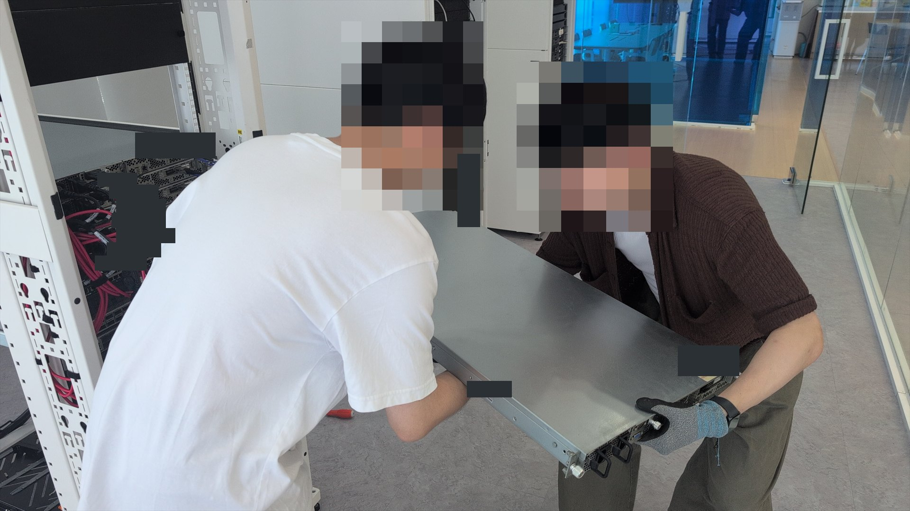
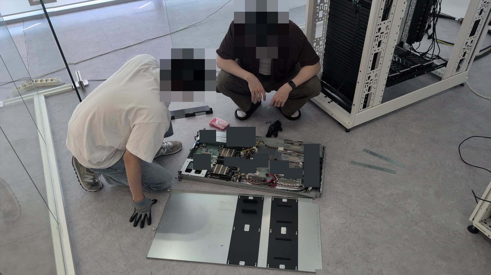
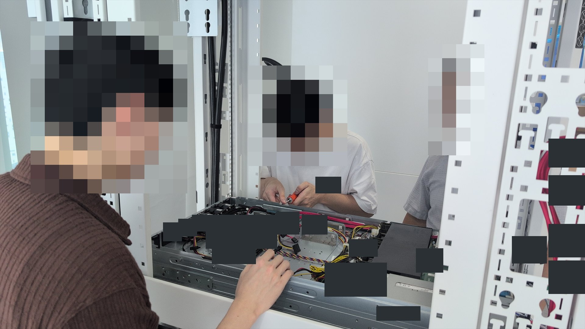

# CHANGE-003: 유휴 서버 3TB 디스크 2개 물리 장착

## 목적과 배경

교육 초기에는 사용 가능한 디스크 4개를 네 팀이 각 1개씩 사용하는 수준이었다.
일부 서버는 내부 저장장치나 네트워크 연결이 준비되지 않아 즉시 활용하기 어려웠고,
정규 물리 서버 실습은 부품 설명과 기본적인 디스크 탈착을 체험하는 범위였다.

사용하지 않던 서버는 기존 실습 환경에 영향을 줄 가능성이 상대적으로 낮았다.
강사의 허가를 전제로, 기존 사용 서버는 건드리지 않고
3TB 디스크 2개를 유휴 서버에 집중 배치하자고 제안했다.
기록 범위는 1차 내부 확인과 상판 재조립·랙 복귀,
이후 서버를 랙에 지지한 상태에서 수행한 2차 HDD 물리 장착까지로 정했다.

## 유휴 서버 선행 활용 시도

별도 유휴 서버를 직접 실습 장비로 활용하고 싶어
USB Linux 설치 환경으로 부팅해 장치 상태를 확인했다.
설치 대상으로 사용할 내부 저장장치가 없음을 확인했고,
당시에는 OS 구성을 진행하지 못한 채 활용 시도를 중단했다.
이 경험은 이후 3TB 디스크 2개가 추가됐을 때 집중 배치를 제안하는 계기가 됐다.

## 제안과 판단

두 디스크를 기존 사용 서버에 한 개씩 나누면 이미 사용 중인 환경을
추가로 바꾸면서도 저장장치가 없는 유휴 서버는 계속 활용하지 못한다.
그래서 기존 사용 서버는 건드리지 않고 두 디스크를 유휴 서버에 집중 배치해
후속 실습 가능성을 열자는 대안을 팀과 강사에게 제안했다.

RAID, 운영체제와 가상화는 이후에 검토할 수 있는 아이디어이며,
이번 작업의 완료 결과에는 포함하지 않았다.

## 허가와 역할 구분

- 장비 사용·섀시 개방과 디스크 사용은 강사의 허가 아래 진행했다.
- 1차 내부 확인의 서버 분리·상판 재조립·랙 복귀는 팀원들과 함께 수행했다.
- 2차 HDD 장착에서는 서버를 랙에서 다시 분리하지 않았고,
  3TB 디스크 2개는 나와 팀원 한 명이 함께 물리 장착했다.
- 기존 사용 서버의 Rocky Linux 재설치와 원격 접속 환경 구성은 팀원이 수행했으며 내 기여가 아니다.
- HDD와 냉각팬 배치에 관한 설명은 강사에게 들었다.
- 다른 교육생의 체험을 수업에 포함한 것도 강사의 결정이었다.

## 실제 수행

### Phase 1 — 초기 내부 확인

1. Linux 설치 환경에서 설치 대상으로 사용할 내부 저장장치가 없음을 확인했다.
2. 팀원들과 서버 양쪽을 지지하며 랙에서 분리했다.
3. 서버를 천천히 바닥으로 내렸다.
4. 바닥에서 섀시 상판을 열었다.
5. DIMM, 드라이브 베이, 냉각팬, 고정 구조와 내부 SD 카드 슬롯을 살펴봤다.
6. 내부 확인을 마친 뒤 상판을 다시 조립했다.
7. 양쪽 레일을 맞춰 서버를 랙에 다시 장착했다.

### Phase 2 — 후속 HDD 장착

1. 이후 3TB 디스크 2개가 확보돼 유휴 서버 집중 배치 대안을 제안했다.
2. 강사의 허가와 작업 지시를 확인했다.
3. 서버를 랙에서 다시 분리하지 않았다.
4. 서버가 랙에 지지된 상태에서 상판만 열었다.
5. 팀원 한 명과 3TB HDD 2개를 물리 장착했다.

두 단계의 작업 과정을 사진으로 기록했다.

## 사진 기록

원본은 비공개 보관한다.
Public Snapshot에는 작업 흐름을 보여 주는 대표 사진 3장만 선별했다.
다른 인물과 장비 식별정보·시리얼·바코드·QR·메타데이터를 검토한 공개용 사본만 사용한다.

<table>
  <tr>
    <td width="33%">
       
      <strong>01 · Phase 1</strong> 
      팀원과 서버 양쪽을 지지하며 랙에서 분리하기 시작했다.
    </td>
    <td width="33%">
       
      <strong>02 · Phase 1</strong> 
      섀시를 열어 DIMM·팬·드라이브 영역과 내부 저장장치 부재를 확인했다.
    </td>
    <td width="33%">
       
      <strong>03 · Phase 2</strong> 
      서버를 랙에 지지한 상태에서 팀원과 HDD 장착을 진행했다. 전체 작업 범위는 3TB HDD 2개다.
    </td>
  </tr>
</table>

## 내부 구조 관찰

**직접 관찰한 내용**

- DIMM과 슬롯, 드라이브 베이, 냉각팬을 살펴보고
  드라이브 베이와 팬의 위치 관계를 확인했다.
- 추가 보드·브래킷으로 보이는 고정 구조의 나사를 직접 돌렸다.
- 해당 구조가 분리 가능함을 확인했지만 완전히 분리하지 않았다.
- 내부 SD 카드 슬롯을 확인했다.

**강사가 설명한 내용**

- HDD 발열을 고려해 드라이브 베이가 냉각팬과 가까운 위치에 배치된 구조라고 설명했다.

**확정하지 않은 내용**

- 유휴 서버의 정확한 모델은 확인하지 않았다.
- 추가 구조물이 SSD·방열 부품 중 무엇을 위한 것인지 확인하지 않았다.
- 정확한 명칭·규격·호환성과 실제 추가 장착 가능 범위는
  사진과 서버 모델을 확인하기 전에는 확정하지 않았다.

## 랙 작업 안전

이번 장비와 작업 조건에서는 서버가 무거웠고 섀시 금속 모서리가 예상보다 날카로웠다.
서버를 꺼내거나 내려놓을 때 기울거나 떨어지면 장비가 손상되거나
작업자가 베이거나 손이 끼는 상황으로 이어질 수 있다고 느꼈다.
재장착할 때는 양쪽 레일을 동시에 맞춰야 했고,
혼자 무게를 지탱하면서 양쪽 정렬까지 확인하기는 어려웠다.
실제로 팀원들이 서버 양쪽을 지지하며 분리와 재배치를 함께 수행했다.
이번 장비와 작업 조건에서는 두 명 이상이 함께 지지하며 작업하는 편이 안전하다고 느꼈다.

## 완료 결과와 개인 기여

완료 범위는 1차 내부 확인에서 수행한 서버 분리·바닥으로 이동·섀시 개방과 내부 구조 확인,
상판 재조립·랙 복귀, 그리고 이후 2차 작업에서 수행한 3TB 디스크 2개의 물리 장착과
사진 기록까지다. 2차 작업에서는 서버를 랙에서 다시 분리하지 않았다.
나는 유휴 서버 집중 배치 대안을 제안하고 1차 서버 분리와 내부 확인,
상판 재조립·랙 복귀에 참여했으며, 2차 작업에서 팀원 한 명과 디스크를 장착했다.

내부 구조와 작업 과정을 기록하고 공동 실습 장비로 확장하는 아이디어 논의에도 참여했다.

## 수업 활동으로의 확대

우리 팀이 주도한 유휴 서버 분리·내부 확인 활동을 계기로,
강사는 다른 교육생들도 서버 내부 구조를 관찰하고 체험할 수 있도록
해당 활동을 수업에 포함했다.

## 수행하지 않은 범위와 후속 아이디어

디스크의 시스템·컨트롤러 인식, BIOS·UEFI·RAID Controller 확인, RAID, SMART 확인,
운영체제 설치, 파티션·파일시스템 생성과 실제 사용 가능 용량 검증은 수행하지 않았다.
가상화, 다중 사용자 환경, 성능·발열·장시간 안정성도 확인하지 않았다.
추가 구조물을 완전히 분해하거나 확장 부품을 실제로 추가 장착하지도 않았다.

팀에서는 해당 장비를 여러 교육생이 함께 사용하는 실습 서버로 확장하는 방안을 논의했다.
RAID·운영체제·가상화·계정·보안·운영 검증은 별도 팀 프로젝트에서 다룰 후속 아이디어다.
