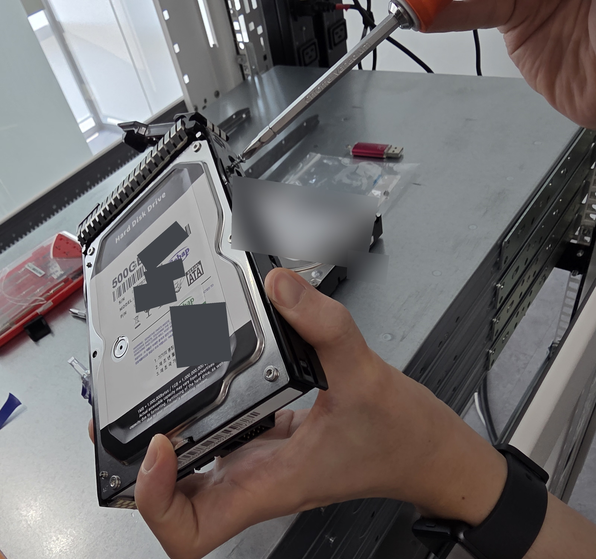
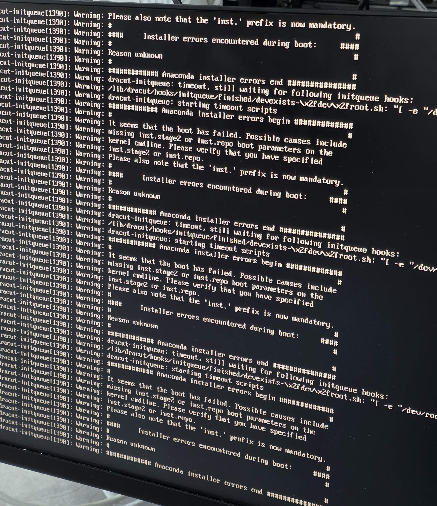
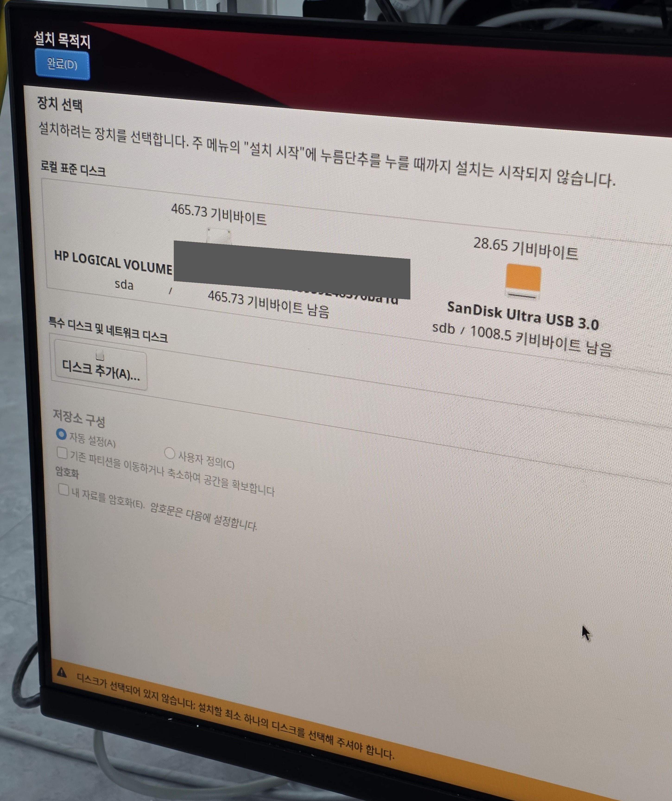
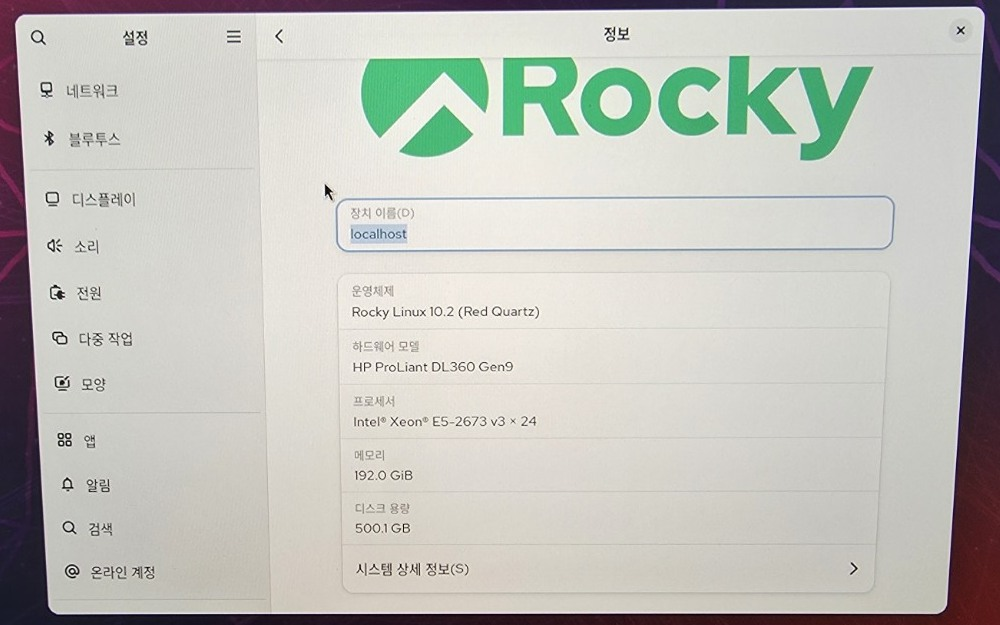

# CHANGE-004: DL360 Gen9 스토리지 구성과 Rocky Linux 10.2 설치

## 목적과 배경

교육 초기에는 개별 서버에서 사용할 수 있는 저장장치가 제한적이었다.
이후 추가 HDD가 공급되면서 별도 HPE ProLiant DL360 Gen9 실습 서버에서
스토리지 구성과 운영체제 설치 흐름을 직접 다시 수행했다.

이 문서의 Storage / OS provisioning unit은 NIC·Link/Carrier와 OpenSSH를 확인한
Network / SSH test unit, 3TB HDD 2개를 물리 장착한 모델 미확정 유휴 서버,
섀시 구조만 살펴본 관찰 장비와 모두 다른 물리 서버다.

## 학습 경로

처음에는 동료와 강사가 디스크·컨트롤러·부팅 설정을 진행하는 과정을 보며 절차를 익혔다.
이후 별도 DL360 Gen9에서 500GB HDD 장착부터 Smart Array 구성,
Rocky Linux 설치까지 직접 다시 수행했다.

## 실제 수행 장비

- 서버: HPE ProLiant DL360 Gen9
- Storage controller: Smart Array P440ar
- 물리 드라이브: 500GB SATA HDD 1개
- 설치 매체: Rocky Linux 10.2 installer USB

실제 rack 위치와 장비 고유 식별정보는 공개하지 않는다.

## HDD 준비와 물리 장착

500GB SATA HDD를 carrier에 준비한 뒤 DL360 Gen9 전면 drive bay에 물리 장착했다.
사진 01은 HDD·carrier·드라이버와 손을 포함한 준비 과정을,
사진 02는 실제 server front와 drive bay에 carrier를 삽입한 작업 맥락을 보여 준다.

## Smart Array 구성

Smart Storage Administrator에서 다음 흐름을 확인하고 구성했다.

```text
500GB SATA physical drive
→ Smart Array P440ar
→ physical drive detection
→ single-drive RAID0
→ Array A
→ Logical Drive 1
→ 465.73 GiB (500.07 GB)
```

이 구성은 500GB HDD 한 개를 사용한 `single-drive RAID0`이다.
디스크 중복성이나 장애 허용을 제공하지 않는다.

## 첫 installer boot 실패

첫 Rocky installer boot에서 다음 메시지를 실제 화면으로 확인했다.

- `dracut-initqueue timeout`
- `Anaconda installer errors`
- `It seems that the boot has failed`
- `inst.stage2`와 `inst.repo` 관련 안내

첫 installer boot가 실패한 사실은 확인했지만 정확한 원인은 확정하지 못했다.

## Retry와 Installation Destination

첫 실패 뒤 `Test this media & install Rocky Linux 10.2` 항목으로 다시 boot했고
installer GUI까지 진행됐다.
이 재시도와 첫 실패 원인 사이의 인과관계는 단정하지 않는다.

Rocky installer의 Installation Destination에서 다음 장치를 구분했다.

- `HP LOGICAL VOLUME`, 465.73 GiB, `sda`
- `SanDisk Ultra USB 3.0`, 28.65 GiB, `sdb`

직접 관찰한 연결 범위는 다음과 같다.

```text
Physical HDD
→ Smart Array P440ar
→ RAID0 Logical Drive
→ HP Logical Volume
→ installer-visible /dev/sda
```

## 설치 완료

Rocky Linux 10.2 설치를 진행한 뒤 reboot하여 GUI가 boot된 것을 확인했다.
Settings → About 화면에서 다음 정보를 확인했다.

- Rocky Linux 10.2 (Red Quartz)
- HP ProLiant DL360 Gen9
- Intel Xeon processor information
- 192.0 GiB memory
- 500.1 GB disk capacity
- `localhost`

`localhost`는 고유 장비 식별정보로 취급하지 않았다.

## 직접 수행과 도움받은 범위

**직접 수행**

- HDD와 carrier 준비
- front-bay HDD 물리 장착
- Smart Array 접근
- single-drive RAID0 Logical Drive 구성
- installer boot와 retry
- Rocky Linux 10.2 설치
- 설치 후 GUI boot 확인

**학습에 도움받은 부분**

- 첫 reference setup에서 동료와 강사의 진행을 관찰했다.
- 절차를 이해한 뒤 별도 서버에서 직접 재현했다.
- 첫 installer failure 때 화면 메시지와 외부 참고 자료를 확인했다.

이 문서의 범위는 실습 서버에서 수행한 단일 디스크 구성과 OS 설치까지다.

## VERIFIED

- 500GB SATA HDD preparation
- front-bay physical installation
- Smart Array P440ar와 physical drive detection
- single-drive RAID0, Array A, Logical Drive 1
- 465.73 GiB logical drive
- Rocky installer의 HP Logical Volume과 `/dev/sda`
- first installer boot failure 기록과 root cause 미확정
- retry와 Rocky Linux 10.2 installation
- installed OS GUI boot

## NOT VERIFIED

- 첫 installer boot failure의 정확한 root cause
- RAID redundancy와 drive fault tolerance
- SMART health validation
- rebuild와 degraded RAID operation
- multi-drive RAID
- storage performance와 장시간 안정성
- 예상하지 못한 controller failure의 troubleshooting
- production operation

## 사진 기록

아래 사진은 원본에서 식별정보와 메타데이터를 제거한 공개용 파생본이며,
작업 순서에 따라 정리했다.

<table>
  <tr>
    <td width="33%">
      <br>
      <strong>01 · HDD preparation</strong><br>
      손, 드라이버, HDD와 carrier를 포함한 물리 준비 과정이다.
    </td>
    <td width="33%">
      <br>
      <strong>02 · Front-bay installation</strong><br>
      별도 DL360 Gen9의 server front와 drive bay에서 수행한 장착 작업이다.
    </td>
    <td width="33%">
      <br>
      <strong>03 · Smart Array result</strong><br>
      Array A, Logical Drive 1과 465.73 GiB RAID0 결과를 보여 준다.
    </td>
  </tr>
  <tr>
    <td width="33%">
      <br>
      <strong>04 · First boot failure</strong><br>
      첫 installer boot 실패 메시지이며 정확한 root cause는 확정하지 않았다.
    </td>
    <td width="33%">
      <br>
      <strong>05 · Installation Destination</strong><br>
      HP Logical Volume `sda`와 SanDisk installer USB `sdb`를 구분했다.
    </td>
    <td width="33%">
      <br>
      <strong>06 · Rocky Linux 10.2 installed</strong><br>
      Settings → About에서 Rocky Linux 10.2, DL360 Gen9,
      192.0 GiB memory와 500.1 GB disk capacity를 확인했다.
    </td>
  </tr>
</table>
