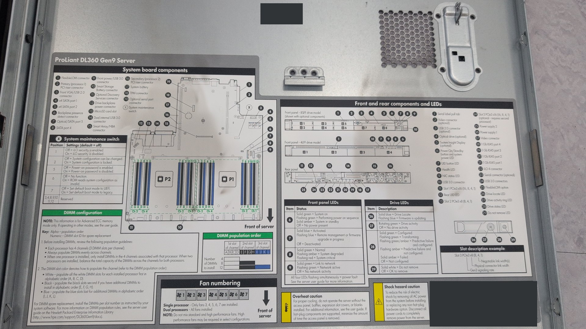
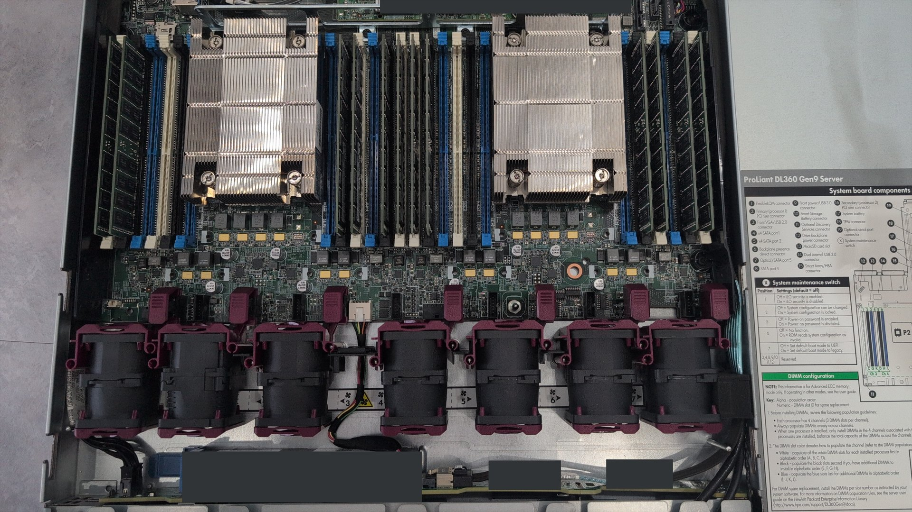
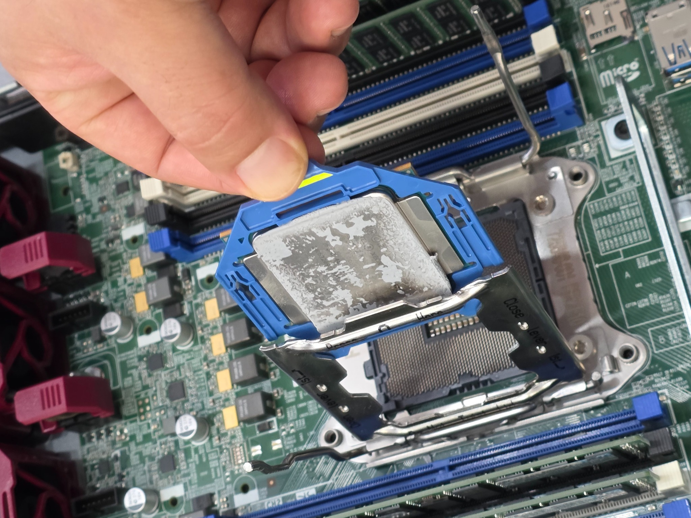
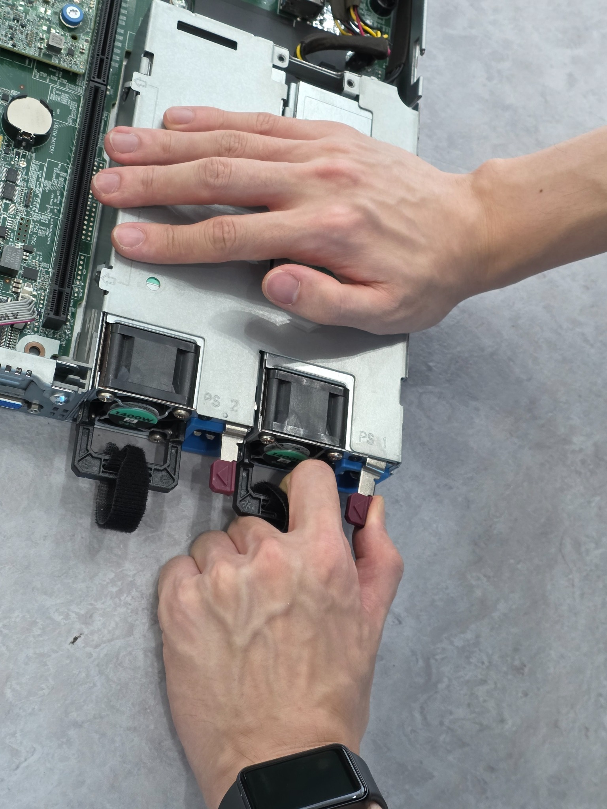

# 별도 HPE DL360 Gen9 Hardware Practice

## 목적

이 문서는 기존 Network / SSH test unit, Storage / OS provisioning unit,
그리고 2×3TB HDD를 장착한 모델 미확정 유휴 서버와 구분되는
별도 HPE ProLiant DL360 Gen9에서 수행한 물리 하드웨어 실습을 기록한다.

핵심 범위는 다음과 같다.

- Access-panel Service Map 확인
- 내부 섀시 구조 확인
- CPU 분리·재장착
- DIMM 분리·재장착
- PSU 분리·재장착

이 작업은 고장 진단, 불량 부품 교체 또는 부품 상태 검증을 목적으로 한 작업이 아니다.

## 장비 구분

이번 hardware practice unit은 기존 NIC / Link 실습 서버와 같은
HPE ProLiant DL360 Gen9 모델 계열이지만 서로 다른 물리 장비다.

또한 다음 장비와도 구분한다.

- 500GB HDD와 P440ar를 사용한 Storage / OS provisioning unit
- 3TB HDD 2개를 물리 장착한 모델 미확정 유휴 서버

정확한 SKU, Firmware, CPU 모델, DIMM 용량과 개별 PSU 모델은 확인하지 않았다.

## Service Map과 내부 구조 확인

상판 안쪽 Service Map을 보며 System Board, DIMM, Fan과 전·후면 구성 안내를
실제 섀시 내부 배치와 대조했다.

상판을 연 상태에서 CPU 영역, DIMM 슬롯, Fan 모듈 열과 확장 영역의 배치를 확인했다.
Service Map은 부품 위치와 배치 관계를 이해하기 위한 기준으로 사용했으며,
사진만으로 개별 부품의 정확한 모델이나 동작 상태를 확정하지 않았다.

## 물리 작업 순서

실습 기록상 작업은 다음 흐름으로 진행했다.

1. 전원 관련 태그와 작업 대상을 확인
2. PDU / PSU 전원 연결 분리
3. 전원 분리 후 전원 버튼 입력
4. 팀원들과 서버를 랙에서 분리
5. 상판 개방과 내부 구조 확인
6. CPU 분리·재장착
7. DIMM 분리·재장착
8. PSU 분리·재장착

이 순서는 이번 실습에서 기록한 실제 작업 흐름이며,
모든 DL360 Gen9 정비 작업에 그대로 적용되는 공식 절차라고 주장하지 않는다.

## CPU · DIMM · PSU Handling

### CPU

CPU를 소켓 영역에서 분리한 뒤 다시 장착했다.
공개 기록은 물리적 remove / reinstall 수행 범위만 보여준다.
CPU 모델, 정상 동작, 부팅 후 인식 결과와 성능은 검증하지 않았다.

### DIMM

DIMM을 분리한 뒤 다시 장착했다.
Service Map의 DIMM 배치 안내와 실제 슬롯 위치를 함께 확인했다.

현재 Public repository에는 DIMM 전용 작업 사진을 별도로 공개하지 않았다.
DIMM 용량, population 상태의 적정성, 메모리 진단 결과와 부팅 후 인식 결과는 확인하지 않았다.

### PSU

PSU module을 분리한 뒤 다시 장착했다.
공개 사진은 PSU의 물리적 remove / reinstall 수행 범위만 보여준다.
PSU 출력, 이중화 상태, 전원 공급 정상 여부와 장기 동작 상태는 검증하지 않았다.

## 확인하지 않은 범위

- 부팅과 운영체제 상태
- iLO 접속과 동작
- Network 연결과 NIC 동작
- Storage 인식, RAID와 Filesystem 구성
- 실제 CPU 모델과 시스템 CPU 인식 결과
- DIMM 총 용량, population 적정성, 개별 메모리 상태
- PSU 출력, redundancy와 전원 상태 검증
- Smart Array 모델과 확장 옵션
- 정확한 SKU와 Firmware
- 고장 원인 진단
- 불량 부품 판정 또는 교체
- CPU·DIMM·PSU의 정상 동작 또는 health validation

확인하지 않은 항목은 완료된 검증이나 break/fix 성과로 확대하지 않는다.

## 공개·안전 메모

섀시 내부와 서비스 라벨에는 장비 식별정보, QR과 바코드가 포함될 수 있어
공개 사진은 식별정보 노출 여부를 확인해 선별했다.

이번 기록은 공식 ESD·PPE 절차를 완료했다는 주장이 아니다.
실제 정비 작업에서는 제조사 절차와 현장 안전 기준을 별도로 따라야 한다.

## 사진 기록

<table>
  <tr>
    <td width="50%">
       
      <strong>01 · Service Map</strong> 
      상판 내부 Service Map에서 System Board, DIMM, Fan과 전·후면 구성 안내를 확인했다.
    </td>
    <td width="50%">
       
      <strong>02 · Internal Layout</strong> 
      CPU 영역, DIMM 슬롯, Fan 모듈과 확장 영역의 내부 배치를 확인했다.
    </td>
  </tr>
  <tr>
    <td width="50%">
       
      <strong>03 · CPU Handling</strong> 
      별도 DL360 Gen9에서 CPU를 분리·재장착했다. CPU 상태나 정상 동작 검증을 의미하지 않는다.
    </td>
    <td width="50%">
       
      <strong>04 · PSU Handling</strong> 
      별도 DL360 Gen9에서 PSU module을 분리·재장착했다. PSU 상태나 출력 검증을 의미하지 않는다.
    </td>
  </tr>
</table>

DIMM 분리·재장착은 수행했지만 현재 Public repository에는 DIMM 전용 작업 사진을 별도로 공개하지 않았다.
